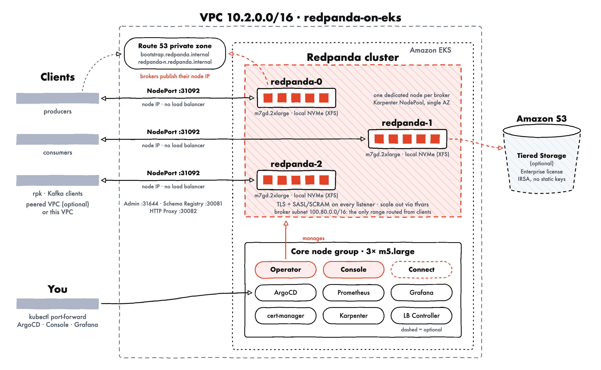

# Redpanda on EKS Stack

Self-managed Redpanda on Amazon EKS, deployed with the official **Redpanda Operator** through ArgoCD.
The configuration follows the Redpanda guide
[Deploy Redpanda for Production in Kubernetes](https://docs.redpanda.com/streaming/current/deploy/redpanda/kubernetes/k-production-deployment/).

| Component | How it is deployed |
|---|---|
| VPC, EKS, Karpenter, ArgoCD, kube-prometheus-stack, cert-manager | Base infrastructure (`infra/terraform`), in this stack's own VPC (`10.2.0.0/16`, configurable) |
| Redpanda Operator `26.2.4` (cluster scope, CRDs) | ArgoCD Application `redpanda-operator` (`redpanda/operator` chart) |
| Redpanda `v26.2.3`, 3 brokers | `Redpanda` resource ([manifests/redpanda/redpanda-cluster.yaml](https://github.com/awslabs/data-on-eks/tree/main/data-stacks/redpanda-on-eks/terraform/manifests/redpanda/redpanda-cluster.yaml)) |
| Redpanda Console | `Console` resource ([console.yaml](https://github.com/awslabs/data-on-eks/tree/main/data-stacks/redpanda-on-eks/terraform/manifests/redpanda/console.yaml)), reached with port-forward by default |
| Redpanda Connect (optional) | ArgoCD Application `redpanda-connect` (`redpanda/connect` chart), or a `Pipeline` resource with a license |
| Enterprise features (with a license) | Tiered Storage (S3), Continuous Data Balancing, Console login and RBAC, Connect `Pipeline` |
| Monitoring | Chart ServiceMonitors + official dashboards from [redpanda-data/observability](https://github.com/redpanda-data/observability) |
| External access | NodePorts on the broker nodes (no load balancer, like BYOC over VPC peering), Route 53 private zone, optional VPC peering |

## Architecture



<sub>Source: [img/redpanda-on-eks-architecture.svg](https://github.com/awslabs/data-on-eks/tree/main/data-stacks/redpanda-on-eks/img/redpanda-on-eks-architecture.svg)</sub>

- **Brokers**: one dedicated node per broker (Karpenter NodePool `redpanda-broker`, tainted
  `redpanda/dedicated=broker`), on-demand, all in `redpanda_zone`. Default `m7gd.2xlarge` with
  6 cores and 24 GiB for Redpanda, memory locking on, `tune_aio_events` on.
- **Storage**: the local NVMe instance store, exposed by the local static provisioner as
  StorageClass `local-storage` and formatted **XFS**. An init container refuses to start on any other filesystem.
- **Security**: TLS on every listener (cert-manager, self-signed CAs `default` and `external`) and
  SASL/SCRAM-SHA-512 on every listener, including the Admin API (`admin_api_require_auth`).
- **Listeners**: internal (`redpanda.redpanda.svc.cluster.local`: Kafka 9093, Admin 9644, Schema
  Registry 8081, HTTP Proxy 8082) and external, on NodePorts (Kafka 31092, Admin 31644, Schema Registry
  30081, HTTP Proxy 30082).

### External access (NodePort)

```
client (this VPC or peered VPC)
  -> redpanda-<n>.redpanda.internal:31092   Route 53 private zone, A record = broker node IP
  -> NodePort on the broker node             Service redpanda-external, externalTrafficPolicy: Local
  -> broker pod redpanda-<n>                 external listeners, TLS + SASL/SCRAM
```

Clients connect straight to the broker nodes, with no load balancer in the data path. This is how
Redpanda BYOC serves clients over VPC peering, and it is what the Redpanda chart recommends when
latency matters. There are no per-GB load balancer charges, and there is one hop less.

- **Addresses**: each broker advertises `redpanda-<n>.<redpanda_external_domain>`, which the external
  TLS certificate covers (`*.<domain>`). Use `bootstrap.<domain>` as the seed address: it resolves to
  every broker.
- **DNS**: node IPs are only known once Karpenter launches the nodes, so each broker publishes its own
  records. A small init container (`route53-dns`, AWS CLI, broker IAM role through IRSA) runs on every
  broker start. It UPSERTs `redpanda-<n>.<domain>` and the broker's entry in the multivalue
  `bootstrap.<domain>` record, both pointing at the node IP. A broker changes node only when its
  node is replaced, and then it restarts and updates the records, the same way the BYOC agent
  manages its Route 53 zone.
- **Firewall**: the node security group opens only the four NodePorts, and only to
  `redpanda_client_cidrs`: the peer VPC CIDR (or this VPC's CIDR without peering) plus
  `redpanda_external_client_cidrs`.

**VPC peering** (`redpanda_peer_vpc_id`) connects a client VPC in the same account and region. The
stack sets up all of it, so clients need no extra setup:

- **Peering connection**: auto-accepted.
- **Routes**: the client VPC routes only the **broker subnet**, which is the secondary CIDR of
  `redpanda_zone` (`terraform output redpanda_client_routed_cidr`). This VPC routes the client CIDR back.
- **DNS**: the private zone is associated with the client VPC, which must have DNS resolution enabled.

**Avoiding routing clashes**: the routed range must not overlap anything the client VPC already
routes. Both ranges are set in `terraform/data-stack.tfvars`:

```hcl
vpc_cidr        = "10.2.0.0/16"                                          # primary CIDR
secondary_cidrs = ["100.80.0.0/16", "100.81.0.0/16", "100.82.0.0/16"]    # one per AZ; brokers use redpanda_zone's
```

The defaults avoid the Redpanda BYOC networks seen in this account (`10.0.0.0/16` and `10.1.0.0/20`)
and `kafka-on-eks` (`10.0.0.0/16`, `100.64-66.0.0/16`). Change them before the first deploy: changing
them later recreates the VPC.

## Prerequisites

AWS CLI, Terraform >= 1.3, kubectl, and (for clients) [rpk](https://docs.redpanda.com/streaming/current/get-started/rpk-install/).

## Deploy

```bash
cd data-stacks/redpanda-on-eks
# Optional: choose the superuser password (otherwise one is generated)
export TF_VAR_redpanda_admin_password='<strong-password>'
# Optional: Redpanda Enterprise license (see "Enterprise features")
export TF_VAR_redpanda_enterprise_license="$(cat redpanda.license)"
./deploy.sh
```

The deployment takes about 30 minutes. At the end, `deploy.sh` waits for the cluster to be Ready, saves
the external CA to `redpanda-ca.crt`, and prints the bootstrap address, the credentials, an `rpk`
profile, and the Console and Grafana port-forward commands.

```bash
export KUBECONFIG=$(pwd)/kubeconfig.yaml
kubectl get redpanda,console -n redpanda
./helper.sh cluster-health
```

## Access (port-forward by default)

| UI | Command | Credentials |
|---|---|---|
| ArgoCD | `kubectl port-forward svc/argocd-server -n argocd 8080:443` → https://localhost:8080 | `admin` / `kubectl -n argocd get secret argocd-initial-admin-secret -o jsonpath='{.data.password}' \| base64 -d` |
| Redpanda Console | `kubectl port-forward -n redpanda svc/redpanda-console 8080:8080` → http://localhost:8080 | none, or a Redpanda SASL user with a license |
| Grafana | `kubectl port-forward -n monitoring svc/monitoring-grafana 3000:80` → http://localhost:3000 | `kubectl get secret grafana-admin-secret -n monitoring -o jsonpath='{.data.admin-password}' \| base64 -d` |

**Console exposure**: set `redpanda_console_exposure = "internal"` (NLB in the broker subnet,
reachable from the peered VPC) or `"internet-facing"` (NLB in the public subnets) to add an NLB. Access
is limited to `redpanda_console_allowed_cidrs`, which defaults to the broker client CIDRs. Console login
(authentication and RBAC) needs an Enterprise license (see "Enterprise features"). Without one, anyone
who reaches Console acts as the operator's bootstrap superuser, so restrict the CIDRs carefully.

## Clients

Superuser credentials:

```bash
terraform -chdir=terraform/_local output redpanda_admin_username
terraform -chdir=terraform/_local output -raw redpanda_admin_password
```

From a client in the peered VPC, with the CA copied to `~/redpanda-ca.crt`:

```bash
rpk profile create redpanda-on-eks \
  --set brokers=bootstrap.redpanda.internal:31092 \
  --set tls.enabled=true --set tls.ca=$HOME/redpanda-ca.crt \
  --set admin.hosts=bootstrap.redpanda.internal:31644 \
  --set admin.tls.enabled=true --set admin.tls.ca=$HOME/redpanda-ca.crt \
  --set sasl.mechanism=SCRAM-SHA-512 --set user=admin --set pass='<password>'
rpk cluster info
```

Kafka clients use `security.protocol=SASL_SSL`, `sasl.mechanism=SCRAM-SHA-512` and the CA as truststore.
Inside the cluster, use the internal listener with the `redpanda-default-root-certificate` CA. See
[examples/rpk-client-pod.yaml](https://github.com/awslabs/data-on-eks/tree/main/data-stacks/redpanda-on-eks/examples/rpk-client-pod.yaml).

Topics and application users can be managed as operator resources:
[examples/redpanda-topics.yaml](https://github.com/awslabs/data-on-eks/tree/main/data-stacks/redpanda-on-eks/examples/redpanda-topics.yaml) and
[examples/redpanda-user.yaml](https://github.com/awslabs/data-on-eks/tree/main/data-stacks/redpanda-on-eks/examples/redpanda-user.yaml).

## Expanding the cluster

1. Set `redpanda_broker_replicas` in `terraform/data-stack.tfvars` to the next odd number, for example `5`.
2. Run `./deploy.sh`.

Karpenter adds the broker nodes. The StatefulSet scales, and each new broker publishes its own DNS
records (`redpanda-<n>` and an entry in `bootstrap`).
Rebalance existing partitions afterwards if needed (`rpk cluster partitions balancer-status`).
Scaling **down** requires decommissioning brokers first (`rpk redpanda admin brokers decommission`).
Do not just lower the value. After scaling down, delete the removed brokers' records from the
private zone, so that `bootstrap` no longer returns them. See
[Scale Redpanda in Kubernetes](https://docs.redpanda.com/streaming/current/manage/kubernetes/k-scale-redpanda/).

## Sizing

The defaults follow the production docs: at least 4 cores per broker, at least 2 GiB per core, and one
node per broker. To change the size, set `redpanda_broker_instance_type`, `redpanda_broker_cpu_cores`
(whole cores, below the node's allocatable CPU), `redpanda_broker_memory` and
`redpanda_broker_storage_size` (below the instance store size). For example, to match the Redpanda
BYOC Tier 1 brokers used by `kafka-on-eks`: `m7gd.large`, 1 core, `6Gi`, `100Gi`.

## Redpanda Connect

`enable_redpanda_connect = true` deploys a sample pipeline that writes generated events to topic
`connect-demo` (an operator `Topic`). It runs as an operator-managed `User` named `connect`, whose ACLs
cover only that topic, over the internal listener with TLS and SASL. `redpanda_connect_deployment`
chooses how it runs:

| Value | Deployment |
|---|---|
| `auto` (default) | `pipeline` with a license, `helm` without one |
| `helm` | `redpanda/connect` chart through ArgoCD. Pipeline: `config` in [helm-values/redpanda-connect.yaml](https://github.com/awslabs/data-on-eks/tree/main/data-stacks/redpanda-on-eks/terraform/helm-values/redpanda-connect.yaml) |
| `pipeline` | Operator `Pipeline` resource ([manifests/redpanda/pipeline-connect.yaml](https://github.com/awslabs/data-on-eks/tree/main/data-stacks/redpanda-on-eks/terraform/manifests/redpanda/pipeline-connect.yaml)). The operator injects the brokers, TLS and SASL. Needs a license that includes Redpanda Connect; **beta** in operator 26.2 |

## Enterprise features

Export the license before deploying. It never goes into tfvars or git:

```bash
export TF_VAR_redpanda_enterprise_license="$(cat redpanda.license)"
./deploy.sh
```

Terraform stores the license in Secret `redpanda-license`. The `Redpanda` resource uses it as the
cluster license (`enterprise.licenseSecretRef`), and the operator uses it as its own license, which the
Connect controller needs. With a license, the stack also turns on these features. Set a variable to
`false` to keep a feature off:

| Feature | Variable (default `true`) | What changes |
|---|---|---|
| [Tiered Storage](https://docs.redpanda.com/streaming/current/manage/kubernetes/tiered-storage/k-tiered-storage/) | `redpanda_enterprise_tiered_storage` | Adds an S3 bucket (`<name>-tiered-storage-*`) and an IRSA role on the broker ServiceAccount (`cloud_storage_credentials_source: sts`, no static keys). Topics upload closed segments to S3, so local NVMe holds the hot data and retention can exceed the disk |
| [Continuous Data Balancing](https://docs.redpanda.com/streaming/current/manage/cluster-maintenance/continuous-data-balancing/) | `redpanda_enterprise_continuous_balancing` | `partition_autobalancing_mode: continuous`: partitions move automatically when brokers are added or lost, or when disks fill unevenly. Useful when [expanding the cluster](#expanding-the-cluster) |
| [Console authentication](https://docs.redpanda.com/streaming/current/console/config/security/authentication/) and [RBAC](https://docs.redpanda.com/streaming/current/console/config/security/authorization/) | `redpanda_enterprise_console_auth` | Users log in to Console with their Redpanda SASL/SCRAM credentials. `redpanda_admin_username` gets the Console `admin` role, and other users need role bindings in [console.yaml](https://github.com/awslabs/data-on-eks/tree/main/data-stacks/redpanda-on-eks/terraform/manifests/redpanda/console.yaml). Terraform generates the JWT signing key |
| [Connect `Pipeline` resources](https://docs.redpanda.com/streaming/current/manage/kubernetes/k-connect-pipelines/) | `redpanda_connect_deployment = "auto"` | When `enable_redpanda_connect = true`, the operator Connect controller runs the sample pipeline instead of the Helm chart |

`terraform -chdir=terraform/_local output redpanda_enterprise_features` lists what is active.
Without a license, none of these features is configured, so the cluster never runs in a restricted
"enterprise features without license" state. Removing the license later turns them off on the next
deploy. With Tiered Storage, data that exists only in S3 stays in the bucket but is no longer readable
through Redpanda.

## Cost estimate

On-demand prices for `us-east-2` (Ohio), 730 hours a month, checked against the AWS Price List API
(`aws pricing get-products`) on 2026-10-05. Taxes, support plans
and the Redpanda Enterprise license (priced by [Redpanda](https://redpanda.com/upgrade)) are not
included. Check current prices with the [AWS Pricing Calculator](https://calculator.aws/).

**Fixed monthly cost, default configuration** (3 brokers, Console with port-forward, Connect off):

| Resource | Quantity | Unit price | Monthly |
|---|---|---|---|
| Broker nodes `m7gd.2xlarge` (8 vCPU, 32 GiB, 474 GB NVMe) | 3 | $0.4271/h | $935.35 |
| Core nodes `m5.large` | 3 | $0.096/h | $210.24 |
| EKS control plane (standard support) | 1 | $0.10/h | $73.00 |
| NAT gateway (fixed hourly part) | 1 | $0.045/h | $32.85 |
| S3 interface endpoint (base `vpc.tf`, 3 AZs) | 3 | $0.01/h | $21.90 |
| EBS gp3: core 3×50 GB, broker root 3×20 GB, Prometheus 50 GB | 260 GB | $0.08/GB-month | $20.80 |
| Public IPv4 (NAT gateway) | 1 | $0.005/h | $3.65 |
| KMS key (EKS secrets encryption) | 1 | $1/month | $1.00 |
| Route 53 private hosted zone | 1 | $0.50/month | $0.50 |
| **Total** | | | **≈ $1,299 / month (≈ $1.78 / hour)** |

The brokers account for about 72% of the total. Clients reach the brokers through NodePorts, so there is
no load balancer cost in the data path. Broker data sits on the instance store, so there is no
EBS cost for it. The Amazon Managed Prometheus workspace (`enable_amazon_prometheus`) costs nothing while
it receives no samples: the base kube-prometheus-stack values keep metrics in the in-cluster Prometheus.

**Usage-based costs** (add these to the fixed cost):

| Item | Price | Rule of thumb |
|---|---|---|
| Client traffic to the brokers | $0 within the same AZ | NodePorts, no load balancer. Same-AZ VPC peering traffic is free |
| Cross-AZ traffic (clients in another AZ than `redpanda_zone`) | $0.01/GB each direction | Put clients in the same AZ to avoid it. Broker-to-broker replication stays in one AZ and is free. Same-AZ VPC peering traffic is free |
| NAT gateway data processing | $0.045/GB | Image pulls and AWS API calls only. Client traffic does not use NAT |
| EKS control plane logs (CloudWatch) | $0.50/GB ingested | Usually a few GB a month |
| Tiered Storage, Enterprise (S3 Standard) | $0.023/GB-month, PUT $0.005/1k, GET $0.0004/1k, plus $0.01/GB through the S3 interface endpoint | ≈ $23.50/month per TB retained in S3 |

**Optional components**:

| Option | Extra monthly cost |
|---|---|
| Console NLB (`redpanda_console_exposure = "internal"`) | ≈ $16.43 + NLCU (small) |
| Console NLB (`"internet-facing"`, 3 public subnets) | ≈ $16.43 + $10.95 public IPv4 + NLCU |
| Redpanda Connect (Helm chart or `Pipeline`) | $0: runs on the core nodes |
| Each additional pair of brokers (for example 3 → 5) | ≈ $623.57 (2 nodes) |

**Ways to lower the cost**:

- **Size for the workload**: with `m7gd.large` brokers (1 core, `6Gi`, `100Gi`; the BYOC Tier 1
  equivalent used by `kafka-on-eks`), the brokers cost $233.89 and the total is about **$598/month**.
- **Commit to usage**: a 1-year Savings Plan or Reserved Instance (no upfront) cuts the broker price by
  about 37%, to about $0.269/h for `m7gd.2xlarge` (−$346/month for 3 brokers).
- **Tear down idle stacks**: `./cleanup.sh` removes everything. Running only during working hours
  (≈ 220 h/month) costs about $390.


## Monitoring

The Redpanda resource enables the chart's ServiceMonitor (`/public_metrics`), and the operator chart
enables its own (with the Connect controller, also a PodMonitor per pipeline). kube-prometheus-stack
scrapes them in all namespaces. Grafana loads these dashboards from
[monitoring-manifests/](https://github.com/awslabs/data-on-eks/tree/main/data-stacks/redpanda-on-eks/monitoring-manifests): Redpanda Default, Redpanda Ops, Kafka Topic Metrics,
Kafka Consumer Offsets and Redpanda Connect. Consumer lag metrics are enabled with
`enable_consumer_group_metrics`.

## Cleanup

```bash
./cleanup.sh
```

The broker data lives on instance store and is lost on cleanup. The Route 53 zone (with the records the brokers wrote), peering, routes
and the Tiered Storage bucket (with its objects) are removed with the stack.
